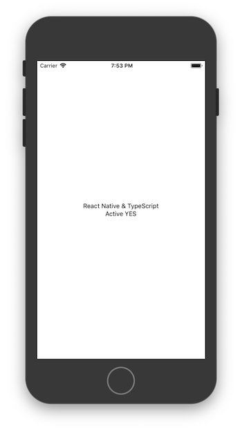

# React Native | TypeScript | Expo CLI v2

#### September 2018

The latest version of [Expo CLI](https://github.com/expo/expo-cli) (v2+) replaces the need for  [`create-react-native-app`](https://github.com/react-community/create-react-native-app) and Expo XDE. The following recipe shows how to create a new Expo app and wire it for TypeScript.

Kudos to [Jan Aagard](https://github.com/janaagaard75) and his version https://github.com/janaagaard75/expo-and-typescript that provided the inspiration. 

>_WOMM™<sup>[(1)](#f1)<sup>_  _version reference_
>
>| App        | Version |
>| ---------- | ------- |
>| Node       | 10.11.0 |
>| TypeScript | 3.0.3   |
>| Expo CLI   | 2.1.3   |
>| Expo       | 30.0.1  |

## Recipe

**Step 1:** Install the latest version of Expo CLI and Typescript

```bash
$ yarn global add expo-cli
$ yarn global add typescript
```

**Step 2:** Create new app

```bash
$ expo init <newApp>
$ cd <newApp>
```

**Step 3:** Initialize TypeScript and update ```tsconfig.json```

```bash
$ tsc --init
```

_tsconfig.json_

```json
{
    "compilerOptions": {
        "target": "es2017",
        "module": "es2015",
        "lib": [
            "es2017"
        ],
        "jsx": "react-native",
        "sourceMap": true,
        "noEmit": true,
        "importHelpers": true,
        "moduleResolution": "node",
        "allowSyntheticDefaultImports": true,
    },
    "exclude": [
        "node_modules"
    ]
}
```

**Step 4:** Install ```react-native-typescript-transformer``` and configure ```app.json```

```bash
$ yarn add -D typescript
$ yarn add -D react-native-typescript-transformer
# Optional ... make sure "importHelpers": true in tsconfig
$ yarn add tslib
```

_app.json_
```json
{
    "expo": {
        "packagerOpts": {
            "sourceExts": ["ts", "tsx"]
        },
        "transformer": "node_modules/react-native-typescript-transformer/index.js"
    }
}
```

**Step 5:** Add Typescript types
```bash
$ yarn add -D @types/react @types/react-native @types/expo @types/expo__vector-icons
```

**Step 6:** Rename ```App.js``` to ```App.tsx```

**Step 7:** Start Expo
```bash
$ yarn start
```

## Result



If you're having issues getting it started, have a look at the source code above. It produced the screenshot above.

---
_**Notes:**_

<sup id="f1">[1]: Works on My Machine<sup>
